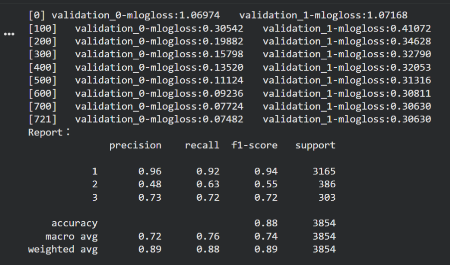
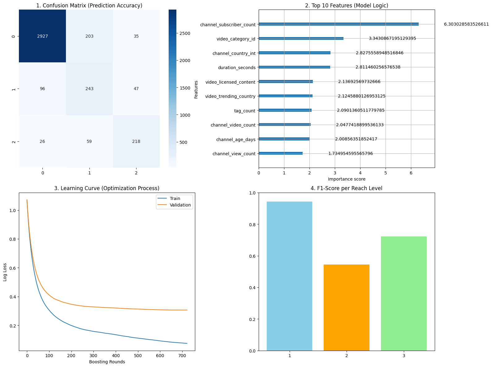

# Machine Learning - YouTube Reach Level Prediction
This project was developed as a team collaboration. I was responsible for the data processing pipeline, which involved transforming raw datasets into a modeled-ready version and performing feature engineering to extract 14 key predictors, and then developed and executed the XGBoost model to generate the final predictive results. My teammates focused on the Random Forest model and the cross-model performance comparison.

## Project Overview
  This project is to develop and evaluate a predictive model to estimate a YouTube video's "Reach Level" within the Hong Kong and Taiwan markets prior to its publication, while identifying the key drivers that significantly influence video performance.

## Dataset Description
  The dataset from Kaggle about trending YouTube videos globally and provided a comprehensive perspective, containing **over 7.63 million video records** spanning 110 countries and regions and it was **14GB**, which is impossible to load directly into Pandas. I implemented **DuckDB** to interface with the massive CSV file. 
  
  By filtering the data by the ‘video_trending_country' column, isolating **Hong Kong** and **Taiwan**. This resulted in a refined subset of **24,086 records**, providing a targeted foundation for training models.

## Methodology
  The target variable for this project is **“Reach Level”**,based on the distribution of video view counts within the dataset. We split video views into three levels using these ranges:

| Reach Level | View Count Range | Percentile Range | 
| :--- | :--- | :--- |
| **Level 1** | < 278,219 | 25th - 50th |
| **Level 2** | 278,219 - 933,977 | 50th - 75th |
| **Level 3** | ≥ 933,978 | > 75th |

At the beginning, a basic set of 11 features was established. However, through iterative testing and hyperparameter tuning, the results remained unsatisfactory, primarily due to the low recall and Macro F1-score for Level 2 videos.

Furthermore, we integrated channel-related features and performed transformations such as calculating channel_age_days to represent creator seniority. The final processed dataset consists of 37 columns, with the training set narrowed down to 14 key features:

| Characteristics | Columns | 
| :--- | :--- |
| **Channel Authority** | subscribers, channel_views, video_count, channel_age, country_int |
| **Video Characteristics** | is_shorts, duration_seconds, category_id, trending_country, licensed_content |
| **Publishing Strategy** | title_length, tag_count, publish_hour, day_of_week |

## Modeling (XGBoost)
  Our strategy focused on Learning Rate, Max Depth, and N-estimators. To specifically address class imbalance, we applied:

* **Sample Weighting:** Utilized class_weight=**'balanced'** to prioritize minority classes.
* **min_child_weight (0.1):** Allowed the model to learn detailed patterns from smaller, specific data groups.
* **Regularization:** Implemented **Early Stopping** (50 rounds) and monitored Learning Curves (using both X_train and X_val) to prevent overfitting.

The optimized XGBoost model achieved a robust balance between precision and generalization:

Accuracy: 0.88

Macro F1-Score: 0.74

Level 2 Recall: 0.63

  
Click to view Detailed Classification Report

   
  

## Key Insights & Feature Importance
The model’s Gain-based Feature Importance revealed the primary drivers of YouTube Reach:

* Channel_subscriber_count: Validates the impact of channel authority.

* Duration_seconds: Highlights the importance of video length in audience retention and trending algorithms.

Logical Consistency Check: The Confusion Matrix confirmed that errors occurred almost exclusively between adjacent levels (e.g., misclassifying L1 as L2), proving the model captured the ordinal nature of video reach.

  
Click to view XGBoost Performance Diagnostics

   
  

### Quick Links
* [**Data Cleaning & Preprocessing (.ipynb)**](./notebooks/Youtube_datacleaning.ipynb)
* [**XGBoost Modeling (.ipynb)**](./notebooks/Youtube_XGBoost.ipynb)
* [**Read Final Report (PDF)**](./Machine_Learning_Project_Report.pdf)
* [**Presentation Slides (PDF)**](./Machine_Learning_Project_ppt.pdf)
* [**Dataset (CSV)**](./data/youtube_hktw_cleaned.csv)
